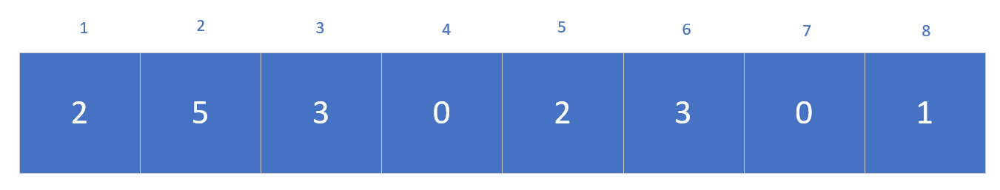
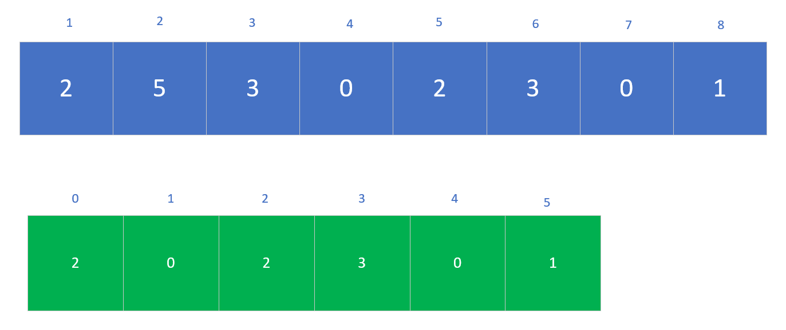
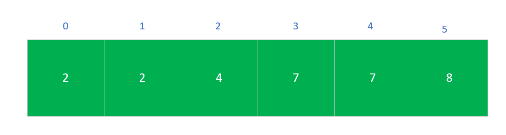
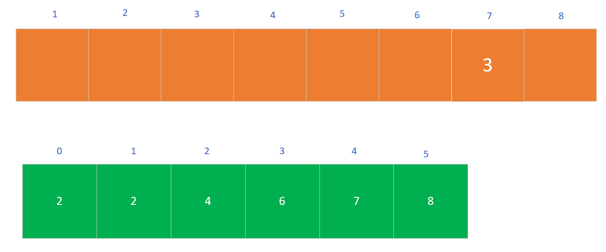
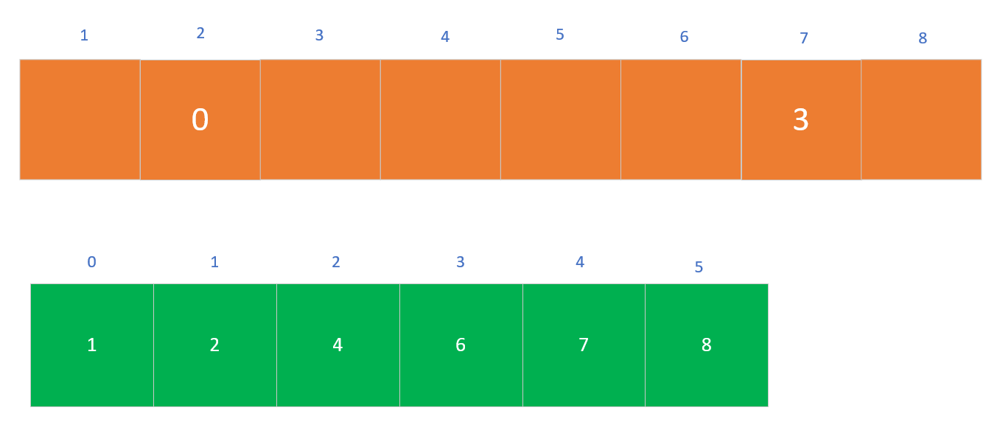
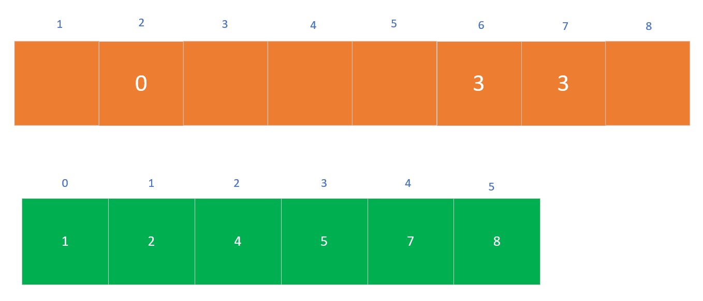
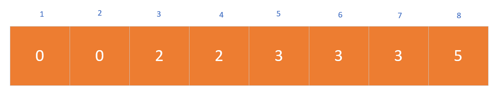

# 计数排序

---

计数排序算法，思想比简单。类似于桶排序的线性时间排序。该算法是对已知数量范围的数组进行排序。复杂度是O(n),对于大范围的集合来说，更适合小范围的集合。

计数排序还是一个基于非比较性质的排序算法。元素从未排序的状态变为已排序的状态的这个过程，是由额外空间的辅助和元素本身的值决定的。

计数排序可以说是基数排序的一个小的基础。后续会继续介绍基数排序，我得弄懂......
**(￣▽￣)"**

---

我们来演示一下整个过程

首先我们有一个数组，如下

然后我们引进了另一个数组，辅助数组。我们首先初始化这个数组的值为0，然后在原数组中统计计数，如下图

然后我们进行迭代，得到了辅助数组的一个整体情况C

再然后，我们便开始把数组中的值，逐一放进另一个数组里面，然后相当于进行排序

然后后续如图:

---

借鉴《算法导论》

